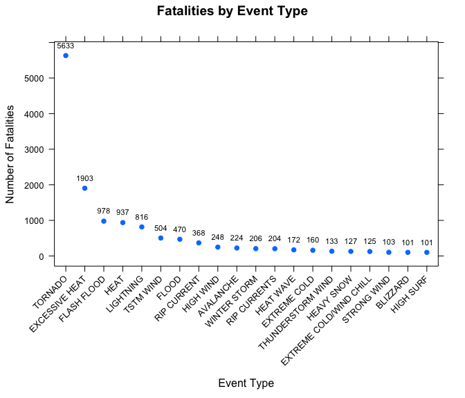
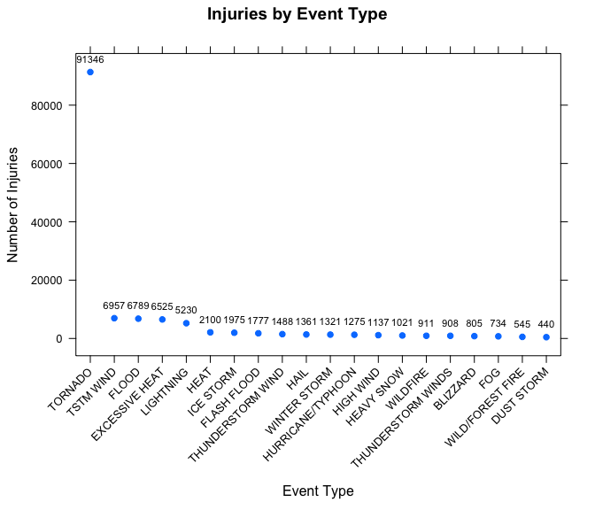
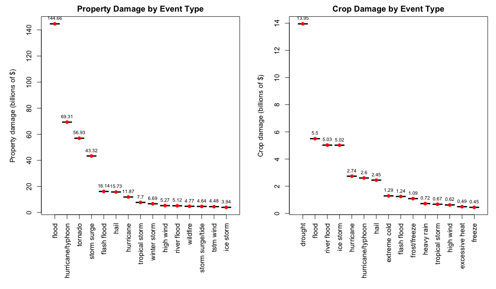

# The Impact of Extreme Weather Events on Property, Crops, and Population Health
Emma Ideal  

## Synopsis
This analysis explores the U.S. National Oceanic and Atmospheric Administration's (NOAA) storm database. 
This database tracks characteristics of major storms and weather events in the United States, including when 
and where they occur, as well as statistics on human fatalities, injuries, property damage, and crop damage resulting from these weather events. Events in the database
occurred between the years 1950 and 2011.
In this analysis, we are interested in evaluating which types of events cause the greatest damage to property and crops as well as population health. We answer the following two questions:  

1. Across the United States, which types of events are most harmful to population health?   
2. Across the United States, which types of events have the greatest economic consequences?


## Data Processing
First load two useful R packages:

```r
library(plyr)
library(lattice)
```
Download the data if it is not already downloaded:

```r
if(!file.exists('repdata-data-StormData.csv.bz2')){
        download.file('https://d396qusza40orc.cloudfront.net/repdata%2Fdata%2FStormData.csv.bz2', destfile='repdata-data-StormData.csv.bz2', method='curl')
}
```
Load the data into an R data frame, caching the result since it is an expensive call:

```r
storm_data <- read.csv('repdata-data-StormData.csv.bz2')  
```
### Data Processing for the Analysis on Population Health
To address the first question listed in the synopsis, we create a new data frame from the storm data. This data frame **healthDF** contains the aggregate number of human fatalities and injuries caused by the various types of severe weather events.

```r
healthDF <- ddply(storm_data, .(EVTYPE), summarize, Fatalities=sum(FATALITIES), Injuries=sum(INJURIES))
```
Two new data frames, **healthDF1** and **healthDF2** are created by ordering **healthDF** in decreasing order of fatalities and injuries, respectively. Then, only the first 20 rows are taken from each, corresponding to the 20 most harmful event types to population health.

```r
healthDF1 <- healthDF[order(healthDF$Fatalities, healthDF$Injuries, decreasing=TRUE),]
healthDF2 <- healthDF[order(healthDF$Injuries, healthDF$Fatalities, decreasing=TRUE),]

healthDF1 <- healthDF1[1:20,]
healthDF2 <- healthDF2[1:20,]
```
The first 6 rows of **healthDF1** (fatalities in decreasing order) are:

```
##             EVTYPE Fatalities Injuries
## 834        TORNADO       5633    91346
## 130 EXCESSIVE HEAT       1903     6525
## 153    FLASH FLOOD        978     1777
## 275           HEAT        937     2100
## 464      LIGHTNING        816     5230
## 856      TSTM WIND        504     6957
```

### Data Processing for the Analysis on Property and Crop Damage
There is an extra complication we must deal with when addressing the second question listed in the synopsis. The storm database stores the amount of damage in U.S. dollars in one column while the unit (thousands, millions, billions of $) is in another column. Therefore, we need to convert all dollar amounts to the same unit; here, the amounts will be converted to billions of dollars.

```r
# Convert the thousands, millions of $ -> billions of $, create new columns with the converted data called 'Property' and 'Crops'
data_conv <- within(storm_data, Property <- PROPDMG*(PROPDMGEXP=='K')/1000000)
data_conv <- within(data_conv,  Property <- ifelse(PROPDMGEXP=='M', PROPDMG/1000, Property))
data_conv <- within(data_conv,  Property <- ifelse(PROPDMGEXP=='B', PROPDMG, Property))
data_conv <- within(data_conv,  Crops <- CROPDMG*(CROPDMG=='K')/1000000)
data_conv <- within(data_conv,  Crops <- ifelse(CROPDMGEXP=='M', CROPDMG/1000, Crops))
data_conv <- within(data_conv,  Crops <- ifelse(CROPDMGEXP=='B', CROPDMG, Crops))
```

Then, as for the population health data processing case, we create a new data frame from the converted data called **econDF**. This data frame contains the aggregate dollar amount of damage (in billions of dollars) to property and crops caused by the various types of weather events.

```r
econDF <- ddply(data_conv, .(EVTYPE), summarize, Prop=sum(Property), Crop=sum(Crops))
```
Two new data frames, **econDF1** and **econDF2** are created by ordering **econDF** in decreasing order of damage to property and crops, respectively. Only the first 15 rows are taken from each, corresponding to the 15 most harmful event types to property and crops.

```r
econDF1 <- econDF[order(econDF$Prop, econDF$Crop, decreasing=TRUE),]
econDF2 <- econDF[order(econDF$Crop, econDF$Prop, decreasing=TRUE),]

econDF1 <- econDF1[1:15,]
econDF2 <- econDF2[1:15,]
```
The first 6 rows of **econDF1** (property damage in decreasing order) are:

```
##                EVTYPE      Prop    Crop
## 170             FLOOD 144.65771 5.49943
## 411 HURRICANE/TYPHOON  69.30584 2.60417
## 834           TORNADO  56.92566 0.31541
## 670       STORM SURGE  43.32354 0.00000
## 153       FLASH FLOOD  16.14081 1.24336
## 244              HAIL  15.72737 2.44883
```


## Results
### Effect on Population Health
With the data frames **healthDF1** and **healthDF2** described above, we can now plot the summed fatalities and injuries as a function of the weather event type.

```r
# Create x-axis labels based on the row order in the healthDF1 data frame (i.e. plot most harmful -> least harmful)
labels1 <- factor(healthDF1$EVTYPE, levels = unique(healthDF1$EVTYPE))
xyplot(healthDF1$Fatalities ~ labels1, pch=19, scales=list(x=list(rot=45)), 
             main='Fatalities by Event Type', xlab='Event Type', ylab='Number of Fatalities',
       panel=function(x, y, ...) {
               panel.xyplot(x, y, ...);
               ltext(x=x, y=y, labels=healthDF1$Fatalities, pos=3, offset=1, cex=0.7)
       })
```

 

The weather events that have caused the largest number of human fatalities are: tornadoes, excessive heat, and flash floods. Tornadoes have caused nearly 3 times as many deaths as the second-leading cause of fatalities (from excessive heat). The plot below shows the number of injuries by weather event type.


```r
# Create x-axis labels based on the row order in the healthDF2 data frame (i.e. plot most harmful -> less harmful)
labels2 <- factor(healthDF2$EVTYPE, levels = unique(healthDF2$EVTYPE))
xyplot(healthDF2$Injuries ~ labels2, pch=19, scales=list(x=list(rot=45)), 
             main='Injuries by Event Type', xlab='Event Type', ylab='Number of Injuries',
       panel=function(x, y, ...) {
                     panel.xyplot(x, y, ...);
                     ltext(x=x, y=y, labels=healthDF2$Injuries, pos=3, offset=1, cex=0.7)
             })
```

 

The weather events causing the largest number of human injuries are: tornadoes, thunderstorm winds, and floods. As in the fatalities data, tornadoes are overwhelmingly leading weather-related causes of injury and have resulted in more than 13 times as many injuries as thunderstorm winds.


### Effect on Property and Crops
With the data frames **econDF1** and **econDF2** described above, we can plot the aggregated damage (in billions of U.S. dollars) to property and crops as a function of the weather event type.

```r
# Create x-axis labels based on the row order in the econDF1 and econDF2 data frames (i.e. plot most damage -> less damage)
labels1 <- factor(econDF1$EVTYPE, levels = unique(econDF1$EVTYPE))
labels2 <- factor(econDF2$EVTYPE, levels = unique(econDF2$EVTYPE))

# Panel plot, with 2 panels
par(mfrow=c(1,2), mar=c(9,5,2,1))

plot(labels1, econDF1$Prop, xaxt='n', ylab='Property damage (billions of $)', main='Property Damage by Event Type')
points(labels1, econDF1$Prop, pch=19, col='red')
text(labels1, econDF1$Prop, labels=round(econDF1$Prop,2), cex= 0.7, pos=3)
axis <- axis(1, las=3, at=labels1, labels=tolower(labels1))

plot(labels2, econDF2$Crop, type='n', xaxt='n', ylab='Crop damage (billions of $)', main='Crop Damage by Event Type')
points(labels2, econDF2$Crop, pch=19, col='red')
text(labels2, econDF2$Crop, labels=round(econDF2$Crop,2), cex= 0.7, pos=3)
axis(1, las=3, at=seq(econDF2[,1]), labels=tolower(labels2))
```

 
The panel plot shown above indicates flooding, hurricanes/typhoons, and tornadoes are the three leading extreme weather causes of property damage, where flooding has resulted in over 144 billion dollars of damage since 1950. Crop damage is caused largely by drought and flooding, though in terms of absolute economic consequences, property damage is more than an order of magnitude more severe than crop damage.

## Challenges
It is important to note in the analysis on property and crop damage that if the damage is not indicated as being in thousands (K), millions (M), or billions (B) of U.S. dollars, the rows are effectively ignored. While this is the case for a considerable fraction of the events, the justification for ignoring these rows is that their damage will be orders of magnitude less than the rows indicated by K, M, or B. Practically as well, we do not know what units these other rows are in! For this analysis, it is reasonable to assume that adding in these other events will *not* change our findings of the most harmful event types to property and crops.
